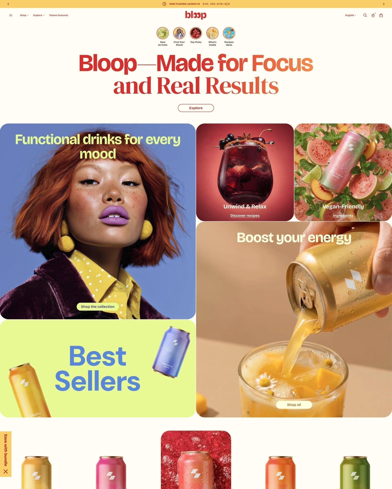

# Avante 14.0.0

#### **Released May, 2026** 

### Added

* **Bloop preset redesigned:** Bloop has been fully rebuilt as a starting point for food and drink stores. If you're in that space, install Bloop fresh from the Theme Store and start from the new layout.
* **Scalable fonts (rem units):** Fonts now scale based on the user's browser settings instead of fixed pixel sizes. No action needed — this improves accessibility automatically. Fine-tune sizes in Theme settings → Typography.
* **Gradient headings and section backgrounds:** Add gradient fills to headings and section backgrounds. Enable in [Theme settings → Colors](../../theme-settings/colors.md).
* **XLarge and XXLarge radius sizes:** Two new corner radius options added. Set them in [Theme settings → Shapes](../../theme-settings/shapes.md).
* **Cascade animations in all drawers:** Menus, cart drawer, store selector, and news drawer now animate with a cascade effect. Enable in [Theme settings → Animation](../../theme-settings/animation.md).
* **Product grid gap controls:** Control the spacing between product cards independently in product-related sections.

<figure><figcaption></figcaption></figure>

<a href="https://app.gitbook.com/o/K80efmNXHuvBg1lgCEjg/s/6DraMvJNYYlFJqlho1aV/" class="button primary">Read the documentation</a>
