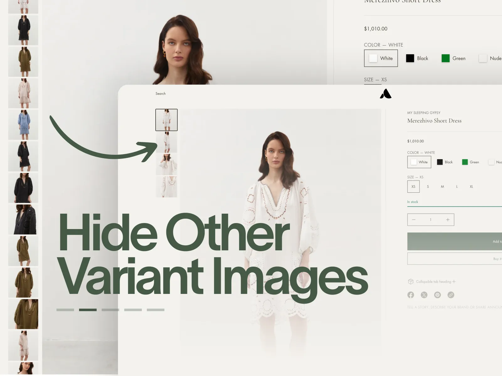
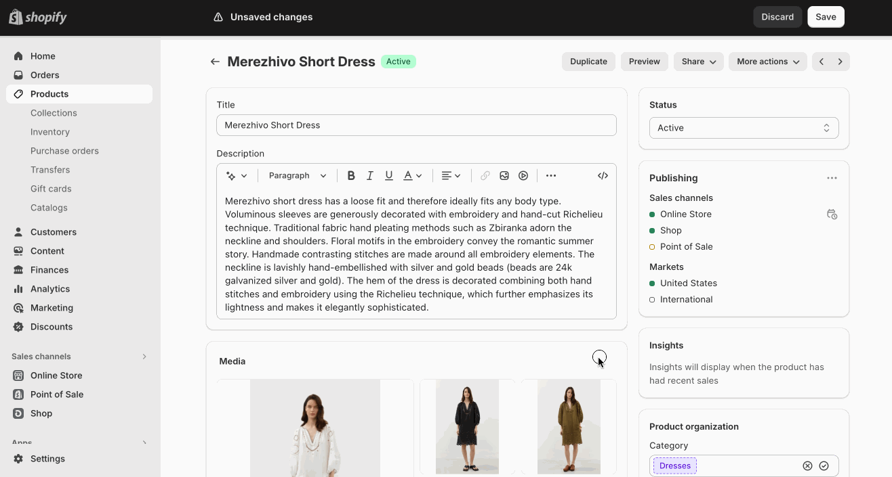
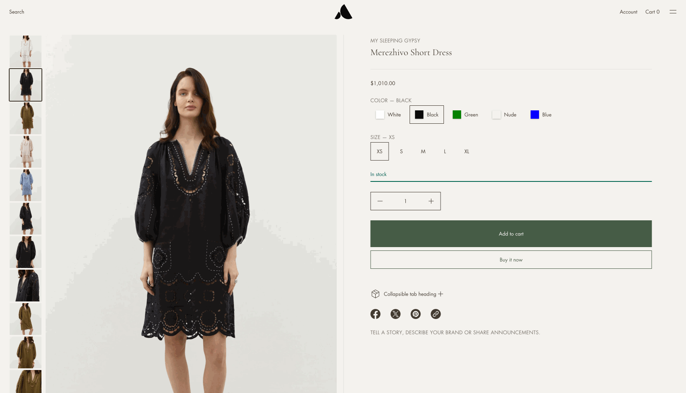

# Display only media related to chosen variant

This feature filters the product gallery to show only images of the currently selected color variant. When a customer switches between colors, only the relevant photos are visible.

<figure><figcaption></figcaption></figure>

***

### How it works

The feature uses image **Alt text** to group photos by color. When a customer selects a variant, the theme reads the color name from the Alt text and hides all images that don't match.


Simply assigning images to variants in Shopify Admin is not enough. You must add the correct Alt text to every image for filtering to work.


***

### Setup

#### Step 1 — Add Alt text to your images

1. Go to **Shopify Admin → Products → \[your product]**
2. Scroll to the **Media** section
3. Click on an image to open it
4. Click **Edit** → **Add alt text**
5. Add the color name in parentheses at the end of the alt text

```
Format:
Any descriptive text (Color name)

Examples:
Front view (Black), Model wearing the dress (Ocean Blue), Detail shot (Ivory White)
```

6. Save
7. Repeat for every image in that color group

<figure><figcaption></figcaption></figure>


The color name inside the parentheses must match exactly across all images of the same color — including capitalization. `(Black)` and `(black)` are treated as different groups.


***

#### Step 2 — Link the variant to its image

Make sure the **first image of each color** is assigned directly to its variant in Shopify Admin:

1. Go to **Shopify Admin → Products → \[your product] → Variants**
2. Open a variant (e.g. Black / S)
3. Assign the main image for that color to this variant
4. Repeat for each color variant

The theme reads the Alt text from this assigned image to know which group to display when that variant is selected.

<figure><figcaption></figcaption></figure>

***

#### Step 3 — Enable the setting in Theme Editor

1. Open **Theme Editor → Products → Default product template** (or your custom product template)
2. Click on the **Product overview** section
3. Find **Show only media of selected variant** and enable it
4. Save

<figure><figcaption></figcaption></figure>

<figure><figcaption></figcaption></figure>

***

### Common issues

<details>

<summary>Images are not filtering when I switch variants</summary>

Check that:

* Every image has Alt text with the color name in **parentheses**
* The color name is spelled and capitalized consistently across all images of the same color
* The variant has an image assigned to it in **Variants** (not just in the Media section)

</details>

<details>

<summary>Only one image is showing in the gallery</summary>

If you see only one photo after enabling the feature, the other images likely have no Alt text or mismatched color names. The theme hides all images it cannot match to the selected variant.

Go back to **Media** and verify the Alt text on every image.

</details>

<details>

<summary>The gallery is not filtering on a specific product</summary>

Check if that product uses a **custom template**. The **Show only media of selected variant** setting needs to be enabled separately in each template it's used on.

Go to **Theme Editor → Products → \[your custom template] → Product overview** and enable the setting there.

</details>


**Tip:** Images without any Alt text (or without parentheses in the Alt text) will be visible for **all color selections** — useful for lifestyle or packaging shots that apply to the whole product.

