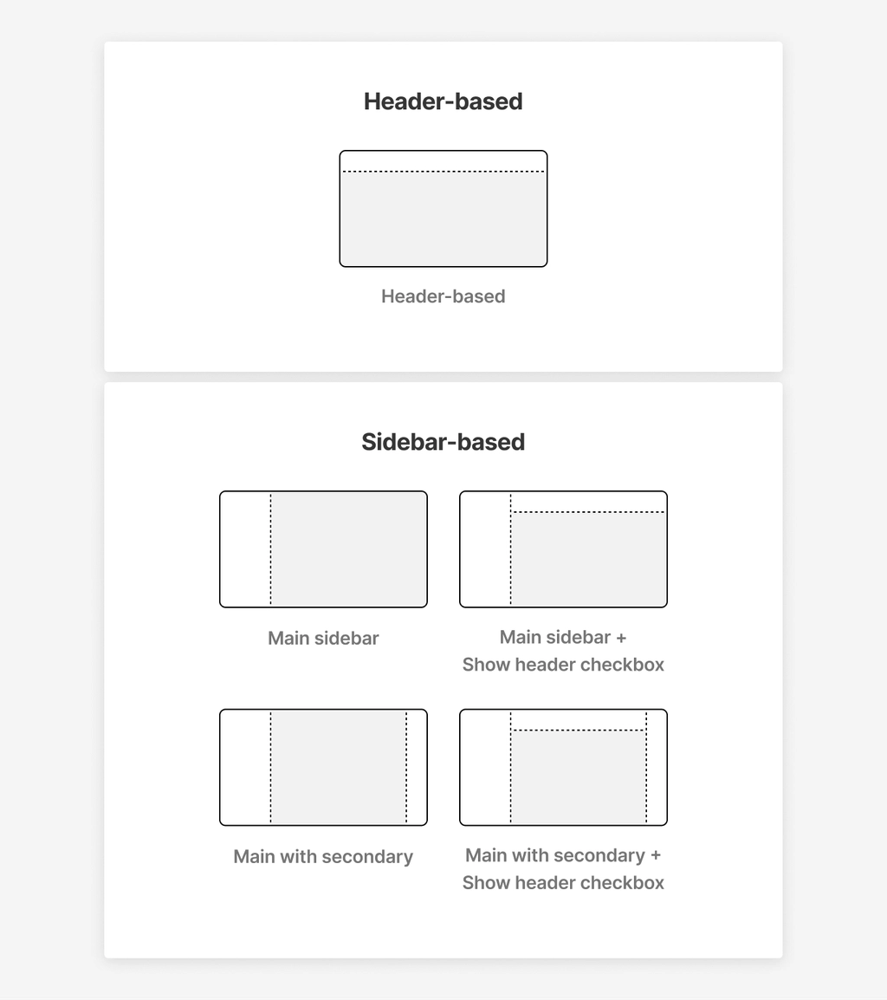

# Appearance

Control your store's navigation layout, spacing, and global visual structure from **Theme settings → Appearance**.

***

### Navigation layout

<figure><figcaption></figcaption></figure>

Choose how customers navigate your store.

| Option            | Description                                                                                                                        |
| ----------------- | ---------------------------------------------------------------------------------------------------------------------------------- |
| **Header-based**  | Classic top navigation. Only the header is displayed — sidebars are disabled.                                                      |
| **Sidebar-based** | Enables sidebars. Choose from 7 combinations of main and secondary sidebar sizes. You can also add a header alongside the sidebar. |


The diagram below shows all available layout configurations — Header-based and the main Sidebar-based combinations.


<figure><figcaption></figcaption></figure>

***

### Sidebar setup

Available only when **Sidebar-based** navigation is selected.

| Setting              | Description                                                                                                                                                                              |
| -------------------- | ---------------------------------------------------------------------------------------------------------------------------------------------------------------------------------------- |
| **Sidebar template** | Select the sidebar layout from 7 options: **Main XS**, **Main XS with secondary**, **Main S**, **Main S with secondary**, **Main M**, **Main M with secondary**, **Main L half screen**. |
| **Show header**      | Display a header above the sidebar. Enabled by a toggle.                                                                                                                                 |


The example below shows **Main S with secondary** — a compact main sidebar on the left and a secondary sidebar on the right.


<figure><figcaption></figcaption></figure>

***

### Transparent header and sidebars

Make the header overlay the first section of the page instead of pushing it down.

| Setting                          | Description                                                                        |
| -------------------------------- | ---------------------------------------------------------------------------------- |
| **Allow transparent navigation** | Enables the transparent overlay effect. Must be combined with a supported section. |
| **Enable on mobile**             | Extends the transparent effect to mobile screens (v8).                             |

> **Supported sections:** Slideshow with media, Image banner, Video banner, Footer.

<figure><figcaption></figcaption></figure>

**Three steps are required** for transparent navigation to work:



Add a supported section (Slideshow, Image banner, or Video banner) to the **top** of your template



Open that section → enable **Overlap by navigation**

<figure><figcaption></figcaption></figure>



If you use Sidebar-based navigation → open **Main sidebar** section in Theme Editor → scroll to **Colors** → set **Color scheme**.

<figure><figcaption></figcaption></figure>


The sidebar will have its own background and override the transparency effect if the **"Swap"** or **"Set"** settings are selected.


<figure><figcaption>
With <strong>Base</strong> selected, the sidebar becomes transparent and the first section shows through.
</figcaption></figure>




For a full guide including logo setup for transparent state, see [**Transparent header**](../features-and-advanced-setup/transparent-header.md)**.**


***

### Other

Global spacing and layout controls.

| Setting                              | Description                                                                                                                              |
| ------------------------------------ | ---------------------------------------------------------------------------------------------------------------------------------------- |
| **Remove side padding for media**    | Lets images and videos go edge-to-edge while keeping text padding intact. Can be overridden per section (v13).                           |
| **White space**                      | Controls spacing between blocks on the page. **Spacious** = larger gaps, **Compact** = tighter layout.                                   |
| **Enable custom product grid gap**   | Unlocks manual control of spacing between product cards in grid sections (v14).                                                          |
| **Column gap (desktop / mobile)**    | Sets the gap in pixels between product card columns. Available when custom grid gap is enabled.                                          |
| **Show lines**                       | Displays divider lines between elements throughout the theme. Line color is inherited from the text color.                               |
| **Line width**                       | Set line thickness from 1px to 4px. Visible only when Show lines is enabled.                                                             |
| **Line opacity**                     | Set line opacity from 0% to 100%. Visible only when Show lines is enabled.                                                               |
| **Center text**                      | Aligns headings and content to center across all templates except navigation. Overridden by individual section/block alignment settings. |
| **Max page width**                   | Sets the maximum width for page sections: 1200px, 1400px, 1700px, or Full-width.                                                         |
| **Include header and footer**        | Applies the max page width to the header and footer as well.                                                                             |
| **Prevent iOS zoom in input fields** | Disables auto-zoom for input fields on iOS, preventing layout shifts.                                                                    |

<figure><figcaption></figcaption></figure>
